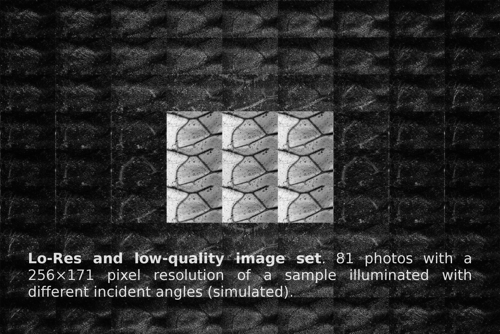

Super Scanner Software (S3)
===========================

Super Scanner Software (S3) is an **free and open-source software environment used for implementing a low-cost scanner 3D**, which can also function as a **microscope and a 3D printer**. S3 is the software portion of [**Super Scanner**](http://en.superscanner.cl) project.

Functions
---------

### Microscope

To obtain high-quality and Hi-Res images, [**Super Scanner**](http://www.superscanner.cl) implements the [Fourier Ptychography](https://sites.google.com/site/gazheng/Fourier-Ptychograph) algorithm.




Software Requirements
---------------------

> **Note:** the correct functioning of these Jupyter modules has been tested in machines that run the 64-bit version of **[Linux Mint 18 'Sarah'](https://www.linuxmint.com/rel_sarah_cinnamon_whatsnew.php)** and **[budgie-remix](https://budgie-remix.org)**, which is based on **[Ubuntu 16.04.1 LTS](https://wiki.ubuntu.com/XenialXerus/ReleaseNotes?_ga=1.19022523.2089693014.1474004057)**.

S3 is a set of Python modules to be executed in notebook [Jupyter](http://jupyter.org) and [Blender](https://www.blender.org). For now, it is sufficient that you install:

- [**Anaconda3 (Python 3.5) 4.1.1**](https://www.continuum.io/downloads).

- [**Blender 2.77a**](https://www.blender.org/download/). It does not require to be installed: download it, untar it and execute it. It also be installed from the command-line with ``$ sudo apt-get install blender``.

- **Git**. Install it from command-line too with ``$ sudo apt-get install git``.

After the installation requirements, **download** Super Scanner Software and **run** Jupyter by first time:

```
$ cd ~
$ git clone https://github.com/josemarroquintoledo/super-scanner-software-s3.git
$ cd super-scanner-software-s3
$ jupyter notebook
```

Folders' Description
--------------------

Within the main folder, **super-scanner-software-s3**:

- **[blend-meshes](blend-meshes/)**: it **contains printable parts and pieces** of Super Scanner Hardware (S2H), **the complete model** of the machine manipulable in Blender and **scenes that execute Blender scripts**.

- **[examples](examples/)**: it is a folder with **sample Jupyter notebooks**.

- **[jupyter-modules](jupyter-modules/)**: it contains **Python modules (libraries) written as Jupyter notebooks**. For example, this notebooks are used by the Fourier Ptychography algorithm and to access to the data and functions of Blender outside of it to simulate the picture taking process for photogrammetry, among others.

- **[img](img/)**: it has **pictures** that are used by some notebooks.

- **[stl](stl/)**: it contains the **meshes as STL files** used in the Blender files.

Importing and Executing the Code
--------------------------------

### In Jupyter

> **Note:** after the installation of [Anaconda3](https://www.continuum.io/downloads), navigate to [autostart](jupyter-modules/autostart) (jupyter-modules&rarr;autostart) and follow the instructions of the notebooks there.

Within of the [examples](examples/) folder, there are **sample notebooks** such as [fp-examples.ipynb](examples/fp-examples.ipynb)

In any notebook, a cell is executed from **Cells**&rarr;**Run Cell** or with <kbd>Shift</kbd> &#43; <kbd>Enter</kbd>.

### In Blender

The files within **blend-scripts** can be imported in Blender from **Choose Screen layout**&rarr;**Scripting**&rarr;<kbd>Open</kbd>. To execute them, press <kbd>Run Script</kbd> button and wait for the result.

#### Execute Blender code in a Jupyter notebook

[panzi](https://github.com/panzi) provides a [respository](https://github.com/panzi/blender_ipython) to run Blender script in Jupyter notebooks. Before to follow the instructions from [there](https://github.com/panzi/blender_ipython), **make sure you installed the dependences**, because Anaconda3 does not resolve them:

```
$ sudo apt-get install python3-pip
$ sudo pip3 install --upgrade pip jupyter ipython notebook
```

References
----------

Dong, S. Guo, K. Nanda, P. Shiradkar, R. & Zheng, G. (2014). FPscope: a field-portable high-resolution microscope using a cellphone lens. *Biomed. Opt. Express, 5*, 3305-3310.

Zheng, G. Ou, X. Hortsmeyer, R. Chung, J. & Yang, Ch. (2014). Fourier Ptychographic Microscopy: A Gigapixel Superscope for Biomedicine. *Optics & Photonics News, 25*, 26-33.

Zheng, G. (2015). *Fourier Ptychographic Imaging: A MATLAB® tutorial*. San Rafael, CA: Morgan & Claypool Publishers.

Dong, S. (2014). *Development of Gigapixel Microscopy*. Retrieved from http://digitalcommons.uconn.edu/gs_theses/687/

> **Note:** the image set and the reconstructed image at the beginning were obtained with a simulated LED grid of 9 lamps over [BobMachines_microscopy-043--fly-wing_flickr_1024x685.tif](img/BobMachines_microscopy-043--fly-wing_flickr_1024x685.tif)
